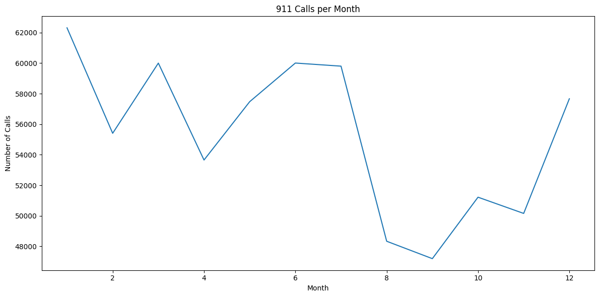

# 911-Calls-Data-Analysis-Capstone-Project

## 📌 Introduction

This project explores and analyzes a dataset of **911 emergency calls** from Montgomery County, Pennsylvania, USA. The goal is to uncover patterns and trends in emergency incidents using Python data analysis techniques and data visualization.  
The analysis also demonstrates practical skills in **data wrangling**, **exploratory data analysis (EDA)**, **time series analysis**, and **visual storytelling**.

---

## 🚨 Problem Statement
Emergency call centers handle thousands of calls daily, but without proper analysis, decision-makers may struggle to:
- Understand the most common emergencies.
- Allocate resources effectively.
- Identify seasonal or time-based patterns in emergency incidents.

This project analyzes over **600,000 records** of 911 calls to answer key questions such as:
- Which zip codes and townships have the highest number of calls?
- What are the most common reasons for calling 911?
- How do emergencies vary by time of day, day of week, and month?
- Are there visible trends or seasonal variations in emergencies?

---

## 🛠 Skills Demonstrated
- **Data Cleaning & Preprocessing** (handling missing values, feature extraction)
- **Exploratory Data Analysis (EDA)** using `pandas`, `numpy`
- **Data Visualization** with `matplotlib` and `seaborn`
- **Time Series Analysis** (trend detection, aggregation)
- **Feature Engineering** from datetime data
- **Grouping & Aggregation** in pandas
- **Visual Pattern Recognition** (heatmaps, clustermaps)

---

## 📂 Data Sourcing

The dataset was obtained from [Kaggle – Montco 911 Calls](https://www.kaggle.com/mchirico/montcoalert).  
It contains real emergency call data from Montgomery County, Pennsylvania.

---

## 📊 Data Description
The dataset includes the following columns:

| Column     | Description |
|------------|-------------|
| `lat`      | Latitude of the incident |
| `lng`      | Longitude of the incident |
| `desc`     | Description of the emergency call |
| `zip`      | Zip code of the incident |
| `title`    | Emergency title, including the reason and type |
| `timeStamp`| Date and time of the call |
| `twp`      | Township where the incident occurred |
| `addr`     | Address of the incident |
| `e`        | Dummy variable (always 1) |

---

## 🧹 Data Preparation
```python
import pandas as pd
import numpy as np
# to import matplotlib and set %matplotlib inline
import matplotlib.pyplot as plt
import seaborn as sns
# loading the dataset
df = pd.read_csv(r"C:\Users\ADMIN\Desktop\Paragon\Python\VS Code\Module-3 Python\Final project\911.csv")
# checking the data info
df.info()
# checking the first 5 rows of the dataset
df.head()
```
The following steps were performed during data preparation:
1. **Loaded the dataset** into pandas DataFrame.
2. **Checked data types** and converted `timeStamp` to datetime objects.
3. **Extracted new features**: `Hour`, `Month`, `DayOfWeek`.
4. **Mapped** `DayOfWeek` numeric values to weekday names.
5. **Created a new column `Reason`** by extracting the category from the `title` column (EMS, Fire, or Traffic).
6. **Handled missing values** in the `zip` column.

---

## ❓ Questions & Answers

### 1️⃣ What are the top 5 zip codes for 911 calls?
```python
# Top 5 zipcodes for 911 calls
top_zipcodes = df['zip'].value_counts().head(5)
print("Top 5 Zipcodes:\n", top_zipcodes)
```
| Zipcodes| Count |
|-----------|-------|
|1. 19401.0 | 45606 |
|2. 19464.0 | 43910 |
|3. 19403.0 | 34888 |
|4. 19446.0 | 32270 |
|5. 19406.0 | 22464 |

**Interpretation:** Zip code **19401** (Norristown area) had the highest number of emergency calls.

---

### 2️⃣ What are the top 5 townships for 911 calls?
```python
# Top 5 townships for 911 calls
top_townships = df['twp'].value_counts().head(5)
print("Top 5 Townships:\n", top_townships)
```
| Townships   | Count  |
|-------------|--------|
|1. LOWER MERION | 55490 |
|2. ABINGTON     | 39947 |
|3. NORRISTOWN   | 37633 |
|4. UPPER MERION | 36010 |
|5. CHELTENHAM   | 30574 |

**Interpretation:** **Lower Merion Township** recorded the highest number of emergency calls.

---

### 3️⃣ What are the most common reasons for a 911 call?

```python

# Create new column 'Reason' by splitting the title column
df['Reason'] = df['title'].apply(lambda x: x.split(':')[0])
# Most common Reason for a 911 call
most_common_reason = df['Reason'].value_counts()
#print("Most Common Reasons:\n", most_common_reason)
# Plotting count of 911 calls by Reason with percentage labels
plt.figure(figsize=(12, 6))
ax = sns.countplot(data=df, x='Reason', palette='viridis')

# Calculate total for percentage computation
total = len(df)

# Annotate each bar with percentage
for p in ax.patches:
    count = p.get_height()
    percentage = f'{100 * count / total:.1f}%'
    ax.annotate(
        percentage, 
        (p.get_x() + p.get_width() / 2., count),  # position at the center top of the bar
        ha='center', 
        va='bottom', 
        fontsize=11, 
        color='black', 
        xytext=(0, 5),  # offset slightly above the bar
        textcoords='offset points'
    )

plt.title("Count of 911 Calls by Reason")
plt.tight_layout()
plt.show()

```

📷 
- EMS 332692
- Traffic 230208
- Fire 100622

**Note:**  
- **EMS** stands for *Emergency Medical Services*, which includes incidents like cardiac arrests, injuries, and other medical emergencies.
- Traffic calls include road accidents, hazards, and congestion issues.
- Fire calls include building fires, gas leaks, and hazardous material incidents.

**Interpretation:** The majority of calls were for **medical emergencies (EMS)**, followed by traffic-related incidents.

---

### 4️⃣ How do emergency calls vary by day of week?
```python
# Checking the data type for sanity
df['timeStamp'].dtype
# Convert 'timeStamp' from string to datetime
df['timeStamp'] = pd.to_datetime(df['timeStamp'])
# Create new time-based columns
df['Hour'] = df['timeStamp'].apply(lambda x: x.hour)
df['Month'] = df['timeStamp'].apply(lambda x: x.month)
df['DayOfWeek'] = df['timeStamp'].apply(lambda x: x.dayofweek)
# Map DayOfWeek numbers to string names
dmap = {0: 'Mon', 1: 'Tue', 2: 'Wed', 3: 'Thu', 4: 'Fri', 5: 'Sat', 6: 'Sun'}
df['DayOfWeek'] = df['DayOfWeek'].map(dmap)
# Countplot of Day of Week by Reason
plt.figure(figsize=(12, 6))
sns.countplot(data=df, x='DayOfWeek', hue='Reason', palette='coolwarm')
plt.title("911 Calls by Day of Week")
plt.legend(loc='upper right')
plt.tight_layout()
plt.show()

```
📷 

---

### 5️⃣ How do emergency calls vary by month?
```python
# Countplot of Month by Reason
plt.figure(figsize=(12, 6))
sns.countplot(data=df, x='Month', hue='Reason', palette='Set2')
plt.title("911 Calls by Month")
plt.legend(loc='upper right')
plt.tight_layout()
plt.show()

```
📷 

---

### 6️⃣ What trends exist in 911 calls per month?
```python
# Group by Month and count number of calls
by_month = df.groupby('Month').count()

# Plot the count of calls per month
plt.figure(figsize=(12, 6))
by_month['twp'].plot()
plt.title("911 Calls per Month")
plt.xlabel("Month")
plt.ylabel("Number of Calls")
plt.tight_layout()
plt.show()

```
📷 

---

### 7️⃣ What does the daily trend of calls look like by reason?
```python
# Separate line plots for each Reason
plt.figure(figsize=(12, 6))
for reason in df['Reason'].unique():
    df[df['Reason'] == reason].groupby('Date').count()['twp'].plot(label=reason)
plt.legend()
plt.title("911 Calls Per Day by Reason")
plt.tight_layout()
plt.show()
```
📷 

---

### 8️⃣ What patterns exist in 911 calls by hour and day of week? (Heatmap)
```python
# Create pivot table with DayOfWeek as index, Hour as columns
day_hour = df.groupby(by=['DayOfWeek', 'Hour']).count()['Reason'].unstack()
day_hour

# Heatmap
plt.figure(figsize=(12, 6))
sns.heatmap(day_hour, cmap='viridis')
plt.title("Heatmap of 911 Calls by Hour and Day of Week")
plt.tight_layout()
plt.show()
```
📷 

---

### 9️⃣ What patterns exist in 911 calls by month and day of week? (Clustermap)
```python
# Clustermap
sns.clustermap(day_hour, cmap='viridis')
plt.title("Clustermap of 911 Calls by Hour and Day of Week")
plt.show()
```
📷 

---

## 📈 Interpretation of Results
- Medical emergencies (EMS) dominate 911 calls, indicating the need for strong health response units.
- Certain zip codes and townships have significantly higher call volumes, suggesting the need for resource prioritization.
- Time-based trends show peak call hours during daytime and weekdays.
- Seasonal patterns suggest possible correlations between certain emergencies and specific months.

---

## 💡 Recommendations
1. **Allocate more EMS resources** to high-volume zip codes and townships.
2. **Deploy targeted traffic safety measures** in regions with high traffic-related call volumes.
3. **Prepare for seasonal spikes** in certain emergencies by analyzing month-specific patterns.
4. **Improve public awareness programs** to reduce non-critical calls.

---

## 🏁 Conclusion

This analysis provides valuable insights into the patterns and trends in 911 emergency calls for Montgomery County, PA.  
By understanding when, where, and why emergencies occur most frequently, emergency response teams can improve **resource allocation**, **response time**, and **public safety strategies**.

---

